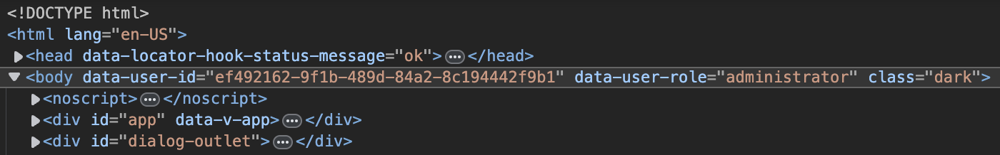

<p align="center"></p>

# current-role-hook

This hook injects the current user ID and role in the body element of the Data Studio.
This is useful when you want to apply custom CSS to a specific user or role.

## Usage

1. Install the extension using a package manager or from the Marketplace:

```sh
pnpm add directus-extension-current-role-hook
```

2. Data attribute gets inject in the body element.



1. Add your custom CSS:

```css
body[data-user-id="..."] {
  /* custom css */
}

body[data-user-role="..."] {
  /* custom css */
}
```
